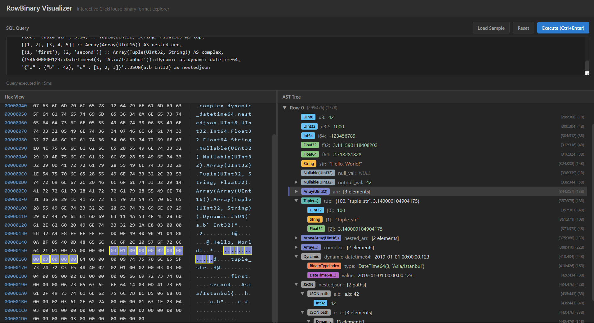

# ClickHouse Format Explorer

A tool for visualizing ClickHouse RowBinary and Native format data. Features an interactive hex viewer with AST-based type visualization. Available as a web app or Electron desktop app.



## Features

- **Format support**: RowBinary and Native, modular system allows adding more
- **Native protocol version**: Select the Native `client_protocol_version` to inspect revision-specific wire layouts
- **Hex Viewer**: Virtual-scrolling hex display with ASCII column
- **AST Tree**: Collapsible tree view showing decoded structure
- **Interactive Highlighting**: Selecting a node in the tree highlights corresponding bytes in the hex view (and vice versa)
- **Full Type Support**: All ClickHouse types including Variant, Dynamic, JSON, Geo types, Nested, etc.
- **Desktop App**: Electron app that connects to your existing ClickHouse server (no bundled DB)
- **CLI (`chfx`)**: Decode `.chproto` / Native / RowBinary dumps to structured JSON from the terminal — agent-friendly

## Quick Start (Docker)

Run with bundled ClickHouse server:

```bash
docker build -t rowbinary-explorer .
docker run -d -p 8080:80 rowbinary-explorer
```

Open http://localhost:8080

### Bundled ClickHouse version

The image bundles a ClickHouse server, pinned to `latest` by default. Choose a
specific version at **build time** with the `CH_VERSION` build argument (it maps
to the `clickhouse/clickhouse-server:<tag>` image tag):

```bash
# docker build
docker build --build-arg CH_VERSION=24.3 -t rowbinary-explorer .

# docker compose
CH_VERSION=24.3 docker compose build
```

The version is baked into the image — rebuild to change it.

## CLI (`chfx`)

A command-line tool that decodes a binary wire-format dump into structured JSON —
the same AST the web UI renders, plus the raw bytes — so it can be scripted or
driven by an agent.

### Quick start

```bash
# from a checkout (no build needed)
npm install
npm run cli -- decode capture.chproto          # decode a native-protocol capture

# or build the standalone binary and run it
npm run cli:build
node dist/cli/index.js decode result.native --format native

# pipe bytes in from anywhere
clickhouse-client -q "SELECT 1 FORMAT Native" | node dist/cli/index.js decode -f native -
```

Output is a single JSON document on **stdout**; diagnostics and a JSON error
envelope go to **stderr**. Exit codes: `0` success, `2` usage error, `1` I/O or
decode error.

### Commands

| Command | Description |
|---------|-------------|
| `chfx decode [file]` | Decode a `.chproto`, Native, or RowBinary dump to JSON. Reads stdin when no file (or `-`) is given. |
| `chfx --help` / `chfx <cmd> --help` | Human-readable help. |
| `chfx --version` | Print the version. |

### `decode` options

| Option | Description |
|--------|-------------|
| `--format`, `-f` `<chproto\|native\|rowbinary>` | Force the decoder. Omitted → autodetect: `.chproto` by magic header, raw bodies by trial decode (ambiguous input errors and asks for `--format`). |
| `--protocol-version <N>` | Native `client_protocol_version` used to interpret a raw Native body (default `0`). |
| `--no-node-bytes` | Omit each node's inline raw bytes (consumers slice `bytesHex` by range instead). Smaller output. |
| `--compact` | Emit single-line JSON instead of pretty-printed. |

### Output shape

```jsonc
{
  "chfx":    { "tool": "chfx", "version": "...", "schemaVersion": 1, "command": "decode" },
  "source":  { "kind": "file", "path": "...", "byteLength": 2417 },
  "format":  "NativeProtocol",          // | Native | RowBinaryWithNamesAndTypes
  "formatDetected": true,                // false when forced via --format
  "protocolVersion": 54482,              // negotiated (chproto) / requested (native) / null (rowbinary)
  "nodeBytes": true,                     // false when --no-node-bytes was passed
  "protocol": { "negotiatedVersion": 54482, "c2sLength": 191, "dumpMeta": { ... } },
  "bytesHex": "0011436c...",            // the whole decoded buffer, encoded once
  "data":    { /* ParsedData: header, rows|blocks, trailingNodes, metadata */ }
}
```

Every node has a `byteRange` of `{start, end}` byte offsets into `bytesHex` (two
hex chars per byte; `start` inclusive, `end` exclusive). By default each node
**also carries its own raw bytes inline** as a `bytes` hex string, so a consumer
can read the bytes behind any value without slicing `bytesHex` itself — pass
`--no-node-bytes` to drop them for smaller output.

> Decoded values are JSON-safe: 64-bit and larger integers become decimal
> strings, and raw byte blobs become hex.

## Desktop App

For developers who already run ClickHouse locally. Download the latest release for your platform from the [Releases](../../releases) page:

| Platform | Format |
|----------|--------|
| Windows  | `.exe` (NSIS installer) |
| macOS    | `.dmg` |
| Linux    | `.AppImage` / `.deb` |

### Configuration

The app looks for a `config.json` file next to the executable:

```json
{
  "host": "http://localhost:8123"
}
```

You can also change the host from the **Host** field in the toolbar. Changes are saved back to `config.json`.

### Building from source

```bash
npm install
npm run electron:dev    # Dev mode with hot reload
npm run electron:build  # Package installer for current platform
```

## Web Development Setup

For local web development (requires ClickHouse at `localhost:8123`):

```bash
npm install
npm run dev
```

Open http://localhost:5173

## Usage

1. Enter a SQL query in the input box
2. Click "Execute" to fetch data from ClickHouse
3. Explore the parsed data:
   - Click nodes in the AST tree to highlight bytes
   - Click bytes in the hex viewer to select the corresponding node
   - Use "Expand All" / "Collapse All" to navigate complex structures
4. When using `Native`, choose a protocol preset to compare legacy HTTP output against newer revisions such as custom serialization, Dynamic/JSON v2, replicated, and nullable sparse encodings

## Example Queries

```sql
-- Basic types
SELECT 42::UInt32, 'hello'::String, [1,2,3]::Array(UInt8)

-- Complex nested structures
SELECT (1, 'foo', [1,2,3])::Tuple(id UInt32, name String, values Array(UInt8))

-- Dynamic/JSON types
SELECT '{"a": 1, "b": "hello"}'::JSON
SELECT 42::Dynamic

-- With typed JSON paths
SELECT '{"user": {"id": 123}}'::JSON(`user.id` UInt32)
```

## Native Protocol Versions

The `Native` format toolbar exposes upstream protocol milestones from `0` through `54483`. This controls the `client_protocol_version` request parameter and the local decoder behavior, so the explorer can parse:

- legacy HTTP Native blocks without `BlockInfo` (`0`)
- per-column serialization metadata (`54454+`)
- sparse and replicated serialization kinds (`54465+`, `54482+`)
- Dynamic/JSON v2 Native layouts (`54473+`)
- nullable sparse serialization (`54483`)

See [docs/native-protocol-versions.md](docs/native-protocol-versions.md) for the revision-by-revision reference, and [docs/nativespec.md](docs/nativespec.md) for the Native layout details.

## Tech Stack

- React + TypeScript + Vite
- Zustand (state management)
- react-window (virtualized hex viewer)
- react-resizable-panels (split pane layout)
- Electron (desktop app, optional)
- Vitest + testcontainers (integration testing)
- Playwright (e2e testing)
